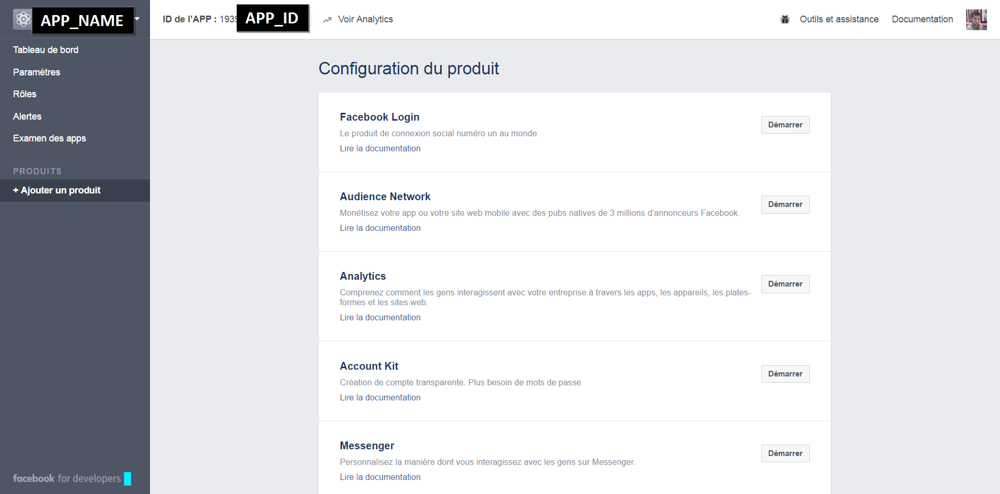
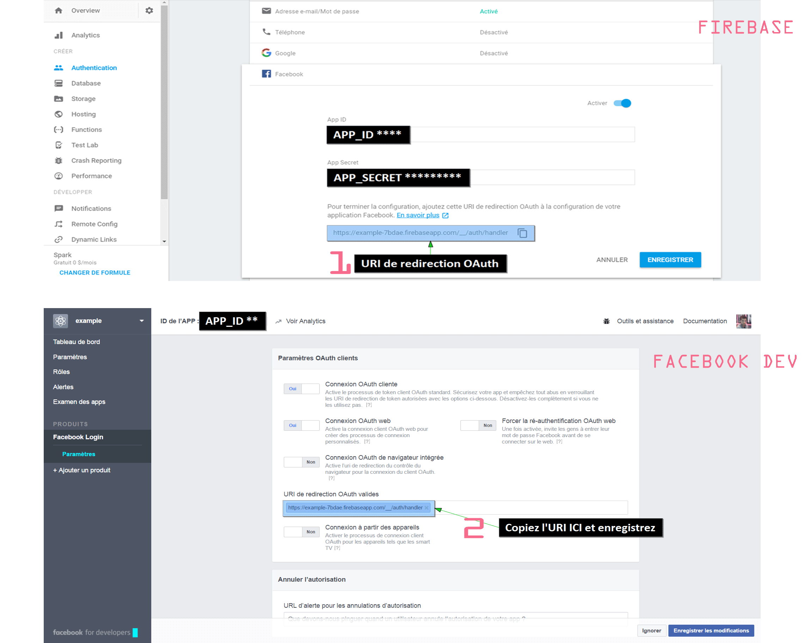

# Connect firebase

*Les technologies ci-dessous, facebook et firebase, peuvent vous demander de créer un compte si vous ne l'avez pas déjà fait au préalable, faites le pour poursuivre l'installation.*

## Prerequis

* Node.js 6+ / npm 3+  -> [Download node.js](https://nodejs.org/en/)
* Ionic 2+ / Cordova   -> npm install -g ionic cordova

------

## Init de facebook developer

------

Rendez-vous sur [facebook-developper](https://developers.facebook.com/) et ajoutez une app.

Une fois cette étape remplie, facebook-developer vous redige vers cette interface:

 

Remarquez le *APP_NAME* et le **APP_ID** en haut à gauche de la page, vous en aurez besoin pour l'installation du plugin cordova.

Ajoutez le produit **Facebook Login** puis enregistrez les modifications.

-------

## Install

------

Installation des dépendances - package.json:

>npm install

Installation du *cordova-plugin-facebook4*:

>ionic plugin add cordova-plugin-facebook4 --variable APP_ID="123456789" --variable APP_NAME="myApplication"

*APP_ID et APP_NAME sont les valeurs du portail Facebook Developer,  reportez vous au screen ci-dessus.*

Voir [Ionic Doc](http://ionicframework.com/docs/native/facebook/)

----------

##  Init de firebase

---------

Rendez-vous sur [console-firebase](https://console.firebase.google.com/) et créez un projet.

Ensuite dans l'onglet *Authentification* -> *Mode de connexion* veuillez activer les fournisseurs de connexion:

1. Adresse e-mail/Mot de passe
2. Facebook

La clé secrète et l'ID de l'app se trouve dans le tableau de bord du developers.facebook.com.

Copiez l'uri de redirection OAuth et la coller dans les paramètres de facebook Login:

### Configuration de firebase

Dans les paramètres du projet et dans "Ajouter Firebase à votre application Web" vous aurez accès aux informations nécessaires pour la configuration des identifiants.

Remplacez ces valeurs dans le fichiers **app.modules.ts** de votre application.

	export const firebaseConfig = {
		apiKey: "YOUR_API_KEY",
  		authDomain: "YOUR_DOMAIN.firebaseapp.com",
    	databaseURL: "https://YOUR_DOMAIN.firebaseio.com",
    	projectId: "YOUR_ID",
    	storageBucket: "YOUR_DOMAIN.appspot.com",
    	messagingSenderId: "YOUR_ID"
	};

----------------

